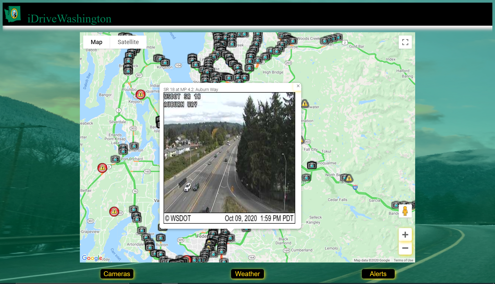

# iDriveWash

## Description
&nbsp;&nbsp;&nbsp;&nbsp;This app is a re-design of Washington Department of Transportation's website to give a more user friendly approach to need to know information.   
&nbsp;&nbsp;&nbsp;&nbsp;This App uses the travel information from wsdot.com and displays them in an interactive manner on the google map on the main page. The user can see the weather, alert, or even a current snapshot of the physical road so that he/she can mank educated decisions on their travel iternary.     
 
Home Page w/Camera Image Active 
 
 

## Usage
https://idrivewashington.azurewebsites.net  

This project is in MVP phase while still updating features and ideas.  
If you have any suggestions about this project, don't hesitate to reach out at benjamin.malkmus@outlook.com

## Acknowledment
Authors: 
* Ben Malkmus   

Built with: 
* Create React App 
* Axios 
* Google Maps API  
* React-Bootstrap Component Library  
* Atlas MongoDB  
* Cors npm  
* Express.js  
* WSDOT API 
* mongoose 

Background Image: 
* Photo by Zane from Pexels

## License
This project is licensed under the MIT License.
